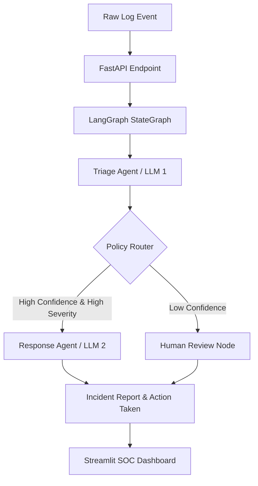

<div align="center">
  <h1>🛡️ Autonomous Intrusion Responder (AIR)</h1>
  <p><i>A Multi-Agent AI Pipeline for Real-Time Threat Analysis & Containment</i></p>

  []()
  []()
  []()
  []()
  []()
</div>

---

## 🎯 The Final Goal
To build a fully autonomous, production-ready Security Operations Center (SOC) agent that can:
1. **Ingest** millions of raw network logs in real-time.
2. **Reason** about threats instantly using an advanced LLM ensemble.
3. **Remember** past attackers via persistent Vector Memory (FAISS).
4. **Respond** and autonomously contain active threats by executing real firewall block commands, requiring human intervention *only* when confidence is low.

## 📌 Current Status
**🟢 Active Development / V2 Released**
We have successfully transitioned from a static dashboard to a functional, agentic responder. 
- **What's Working:** Multi-agent reasoning (Triage & Response), LangGraph state management, Streamlit SOC Dashboard, historical memory (FAISS), and asynchronous log ingestion via Redis Queue.
- **What's Next:** Scaling production deployments with Kubernetes, adding more security toolkits (e.g., AWS WAF integration), and improving behavioral evaluation scores against zero-day attacks.

---

## 🧠 Why AIR? (Agent vs. Classifier)

A traditional classifier model takes an input and spits out a label. That's a single step. **AIR does something different—it reasons, decides, and acts.**

1. 🕵️ **Triage Agent:** Analyzes the raw log, classifies the threat, and computes a confidence score.
2. 🔀 **Policy Router:** Uses the severity and confidence score to decide the graph's path. *This is a decision, not a prediction.*
3. ⚔️ **Response Agent:** If the threat is High/Critical with High Confidence, this agent autonomously drafts and executes a containment playbook (e.g., blocking an IP).
4. 🧑‍💻 **Human Review:** If confidence is low, the AI refuses to guess and flags the incident for manual human analysis.

---

## 🏗️ Architecture Visualization



---

## ✨ Key Features
- **Real-Time Log Ingestion:** Pipe system logs directly to the AI.
- **Asynchronous Processing:** Redis Queue and background workers for handling high-volume traffic.
- **Autonomous Response:** Capability to actually block IP addresses and execute firewall rules.
- **Historical Memory:** Remembers past attackers using FAISS vector search.
- **Beautiful Observability:** Dark-themed, responsive SOC dashboard built with Streamlit.

---

## 🚀 Quick Start Guide

### 1. Prerequisites
Ensure you have Python 3.10+, Git, and Redis (optional, for queueing) installed.

### 2. Installation
```bash
# Clone the repository
git clone https://github.com/Lalith0024/Autonomous-Intrusion-Responder-.git
cd autonomous-intrusion-responder

# Set up environment variables
cp .env.example .env
# Open .env and add your GROQ_API_KEY

# Install dependencies
pip install -r requirements.txt
```

### 3. Running Locally
You need to run both the backend API and the frontend dashboard.

**Terminal 1: Start the API Engine**
```bash
python run.py
```

**Terminal 2: Start the SOC Dashboard**
```bash
streamlit run src/streamlit_app/dashboard.py
```

---

## 📊 Batch Analysis & Dataset
Want to test the AI against real network intrusion data?
This project automatically downloads the **Network Intrusion Dataset from Kaggle** via `kagglehub`.

Run the batch analyzer to evaluate the agent against 50 real-world events:
```bash
python src/data/batch_runner.py
```
*Results are saved to `data/results/batch_results.json` and can be visualized in the Dashboard.*

---

## 🛡️ Production & Protection Guide
Are you ready to hook this up to a live server? We have a dedicated guide for deploying AIR to production, enabling actual firewall blocking, and piping real Nginx/Apache logs.

👉 **[Read the Full Production Guide (PROTECT_YOUR_SITE.md)](./PROTECT_YOUR_SITE.md)**

```bash
# For a full production spin-up (API, Redis Queue, Background Workers, Dashboard)
docker-compose up --build -d
```

---

## 💻 Tech Stack

| Layer | Technology | Purpose |
|---|---|---|
| **API & Routing** | FastAPI | High-performance async endpoints (`/analyze`, `/ingest`) |
| **Orchestration** | LangGraph | State management and multi-agent routing |
| **Intelligence** | Groq (Llama-3.3-70b) | Lightning-fast inference for Triage & Response |
| **Memory** | FAISS | Vector similarity search to remember attack patterns |
| **Queueing** | Redis | Asynchronous job processing for high scale |
| **Dashboard** | Streamlit | Beautiful, interactive frontend for SOC analysts |
| **Data Parsing** | Pydantic | Enforces strict schema structuring from the LLMs |

<div align="center">
  <br>
  <p>Built with ❤️ to keep servers safe.</p>
</div>
