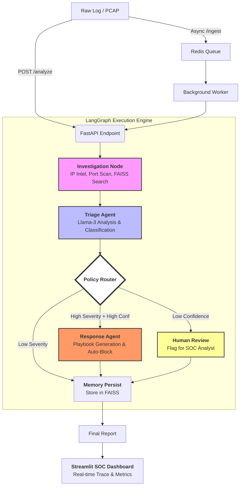

<div align="center">
  
  <h1>🛡️ Autonomous Intrusion Responder (AIR)</h1>
  <p><i>A Multi-Agent AI Pipeline for Real-Time Threat Analysis, Memory-Augmented Reasoning & Autonomous Containment</i></p>

  []()
  []()
  []()
  []()
  []()
  []()
</div>

---

## 📖 Overview

**AIR** (Autonomous Intrusion Responder) is a next-generation Security Operations Center (SOC) agent. Unlike static rule-based systems, AIR uses a **Multi-Agent LangGraph architecture** to reason about network threats, investigate source IPs using real security tools, consult historical memory (FAISS), and autonomously execute containment actions.

It is designed to handle the "noise" of modern networks, allowing security teams to focus on critical incidents while the AI manages triage and initial response at machine speed.

---

## 🛠️ Technology Stack

| Layer | Technology | Role |
| :--- | :--- | :--- |
| **Orchestration** | [LangGraph](https://github.com/langchain-ai/langgraph) | State management & multi-agent routing logic. |
| **Intelligence** | [Groq](https://groq.com/) (Llama 3.3 70B) | High-speed inference for complex security reasoning. |
| **API Framework** | [FastAPI](https://fastapi.tiangolo.com/) | Async endpoints for log ingestion & agent interaction. |
| **Memory** | [FAISS](https://github.com/facebookresearch/faiss) | Vector database for long-term incident memory & pattern matching. |
| **Frontend** | [Streamlit](https://streamlit.io/) | Premium SOC Dashboard for real-time observability & human-in-the-loop. |
| **Async Tasks** | [Redis](https://redis.io/) | High-throughput queueing for asynchronous log processing. |
| **Data Integrity**| [Pydantic](https://docs.pydantic.dev/) | Strict schema validation for all log events and agent outputs. |

---

## 📂 Project Structure

```text
autonomous-intrusion-responder/
├── 📁 data/                  # Persistent data (Vector index, results, sample logs)
├── 📁 src/                   # Core Source Code
│   ├── 📁 agents/            # LLM Logic: Triage & Response agent prompts/logic
│   ├── 📁 api/               # FastAPI implementation (Routes, Lifespan)
│   ├── 📁 core/              # System Config & Execution Tracing (Tracer)
│   ├── 📁 data/              # Log Parsers (CICIDS-2017) & Batch Processing
│   ├── 📁 evals/             # Agent evaluation engine (Benchmarking)
│   ├── 📁 graph/             # LangGraph Orchestration (The "Brain")
│   ├── 📁 memory/            # FAISS Vector Store implementation
│   ├── 📁 models/            # Pydantic Schemas for data consistency
│   ├── 📁 queue/             # Redis Ingestion Worker & Client logic
│   ├── 📁 streamlit_app/     # SOC Dashboard & Visualization pages
│   └── 📁 tools/             # Security Toolkit (Port scan, IP lookup, Firewall)
├── Dockerfile                # Production containerization
├── docker-compose.yaml       # Multi-container orchestration (API + Redis + Worker)
├── requirements.txt          # Project dependencies
└── run.py                    # Entry point to start the API
```

---

## 🧠 How It Works: Agentic Reasoning vs. Classification

A traditional security system uses a simple classifier (Input → Label). **AIR** uses an autonomous reasoning loop:

1.  🕵️ **Triage Agent**: Analyzes the raw log event, classifies the threat, and computes a confidence score. It doesn't just guess; it explains *why* it thinks something is an attack.
2.  🔀 **Policy Router**: Acts as the system's "Prefrontal Cortex". It decides the graph's path based on severity and confidence.
3.  ⚔️ **Response Agent**: If a threat is Critical and Confidence is high, this agent autonomously drafts a containment playbook and executes blocking tools.
4.  🧑‍💻 **Human Review Node**: If the AI is unsure (Confidence < 70%), it refuses to take automated action and flags the incident for a human analyst to review in the dashboard.
5.  📚 **Vector Memory**: Every incident is indexed into FAISS. The next time the same IP or a similar attack pattern occurs, the Triage Agent "remembers" the past context.

---

## 🔄 End-to-End System Flow

The diagram below illustrates how a single log entry transforms into an autonomous security action.



---

## 🚀 Local Initialization Guide

Follow these steps to set up the complete pipeline on your local machine.

### 1. Environment Setup
```bash
# Clone the repository
git clone https://github.com/Lalith0024/Autonomous-Intrusion-Responder-.git
cd autonomous-intrusion-responder

# Create a virtual environment
python -m venv .venv
source .venv/bin/activate  # Mac/Linux

# Install dependencies
pip install -r requirements.txt
```

### 2. Configuration
Create a `.env` file from the example:
```bash
cp .env.example .env
```
Update `.env` with your API keys:
- `GROQ_API_KEY`: Get one from [Groq Console](https://console.groq.com/).
- `REDIS_ENABLED`: Set to `true` if you have Redis running (optional).

### 3. Launching the System

You need to run the **Backend API** and the **Frontend Dashboard** simultaneously.

#### **Terminal 1: Start the API Engine**
This starts the FastAPI server which hosts the LangGraph agent.
```bash
python run.py
```
*The API will be available at `http://localhost:8000`*

#### **Terminal 2: Start the SOC Dashboard**
This launches the Streamlit interface for monitoring and manual testing.
```bash
streamlit run src/streamlit_app/dashboard.py
```
*The Dashboard will open in your browser at `http://localhost:8501`*

---

## 🧪 Testing & Evaluation

### Batch Analysis
To test the agent's performance against a large set of real-world intrusion data (CICIDS dataset):
```bash
python src/data/batch_runner.py
```
Results will be saved to `data/results/batch_results.json` and can be explored in the "History" tab of the dashboard.

### Evaluation Engine
To run deep behavioral evaluations and calculate accuracy scores:
```bash
python src/evals/evaluation_engine.py
```

---

## 🛡️ Production Deployment
For production environments, we recommend using **Docker Compose** to spin up the API, Redis, and the Background Worker together:
```bash
docker-compose up --build
```
Detailed production hardening (Firewall hooks, Nginx piping) can be found in [PROTECT_YOUR_SITE.md](./PROTECT_YOUR_SITE.md).

---
<div align="center">
  <p>Developed with precision for the modern security landscape.</p>
  <b>Autonomous Intrusion Responder © 2026</b>
</div>
